### Primer:

$P=0.01$

$C=10\ \frac {Gb} {s}$

$F=1542\ B$

$D = 1500\ B$

$A = 84\ B$

$L=128\ km$

$v = 200000\ \frac {km} {s}$

$T_o = 2*T_Z + T_A
$

*-* - - - - - - - - - - - - - - - 

$T_D = \frac {D} {C}
$

$T_Z = \frac {L} {v}$

$E_{ARQ} = 0.08$ - 8% izkoriščenost

Kaj lahko naredimo, da povečamo izkoristek?

* povečamo velikost okvirja

* v naprej pošiljamo naslednje okvirje (**protokoli brez čakanja**)
  
  ---

## Protokoli brez čakanja

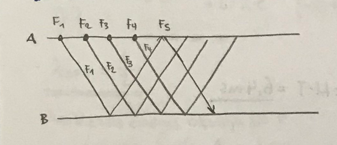

* **DRSEČE OKNO** - št. okkvirjev, ki so poslani in nepotrjeni

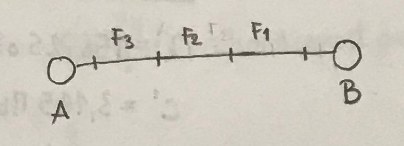

* Potrebujemo **OBOJEMEREN PRENOS** ~ **FULL-DUPLEX**
  
  $W_{OPT.} = \frac {T_S} {T_F}$   ..... $W_{OPT.}$ je tudi **velikost začasnega pomnilnika** (**buffer**) na strani pošiljatelja

* Kaj pa če pride do napake?
  
  * Počaka na pravilno prejet naslednji okvir - vsi okvirji, ki niso v pravilnem vrstnem redu, jih zavžemo.
    
    * **GBN** - Go back N
  
  * sprejmemo predčasno vse okvirje če tudi ne v pravem vrstnem redu 
    
    * **SRP** - Selective repeat

$E_{GBN} = min(1, \frac {w\ *\ T_f} {T_S})$

        $P=0$

$E_{GBN} = 1 - P * \frac { T_S } {T_F}$

$E_{SRP} = min(1, \frac {w\ *\ T_f}{T_S})$

        $P=0$

$E_{SRP} = 1 -P$

* Pri **GBN** lahko kdaj, ko čakamo na odgovor na prvo sporočilo, pošljemo sporočila velikosti enega okna. **buffer pošiljatelja** je **velikost okna**. Na strani sprejemnika ni bufferja.

* Pri **SRP** je na strani sprejemnika buffer velikosti **2 x velikost okna**. Pošiljatelj ima buffer velikosti **min velikosti okna**

ARQ ---------------------------> GBN ---------------------> SRP

Najbolj posogst                                                Najmanj pogost

----

# NADZOR DOSTOPA DO PRENOSNEGA SREDSTVA (MAC)

## Težave MULTIPLEKSIRANJA

* uporabniki imajo različne zahtve (nalaganje HTML / prenos velike datoteke)
  
  * Če kanal razdelimo na enake časovne intervale (časovno multipleksiranje), bodo zahtevni uporabniki prikrajšani - enaka enota toda veliko večja potreba. Kanal bo neizkoriščen, saj bi lahko zahtevnim uporabnikom sicer dodelili več kanala, a tega ne naredimo, ker imajo vsi uporabniki določen enak časovni interval

$λ\ -\ pretok\ okvirjev$

$\frac {1}{M} \ - \ povprečna\ dolžina\ okvirjev$

$C\ - \ kapaciteta\ kanala$

$T = \frac {1} { MC\ -\ λ}$

* C = 100 Mbps

* λ = 5000 okv / s

* 1/M = 10 000b

* T = 200ms
  
  * $λ^{'} = 156.25\ okv/s$
  
  * $C^{'} = 3.125\ Mbps$
  
  * $T^{'} = \frac {1} { δ \frac {M}{N} - \frac {λ} {N}} = N * T = 6.4ms$

* Rešitev: Kanal lahko razdelimo glede na potrebe uporabnikov - **Statična delitev**

* Težava: To je v naprej določeno in se po določitvi ne spreminja

## Dinamično dodeljevanje

* <u>Izhodišče</u>:
  
  * uporabniki si delijo skupni komunikacijski kanal
  
  * trčenje - če oddaja hkrati več kot ena postaja
  
  * pošiljanje naslednjega okvirja po uspešnem prenosu prejšnjega

* <u>Rešitve:</u>
  
  * **<u>Centralizirano upravljanje</u>**
    
    * WiFi z dosopnimi točkami
    
    * Bluetooth
  
  * **<u>Omrežje z naključnim dostopom</u>**
    
    * Ethernet
    
    * Vsak lahko oddaja podatke kadar koli želi
    
    * Pri trčenju vsaka naprava počaka naključno mnogo časa preden spet začne oddajati
      
      * možnost, da sta časa različna in ne pride več do trka
  
  * **<u>Omrežja z žetonom</u>**
    
    * Kam dodamo novo napravo?
    
    * Kako odstranimo napravo?
    
    * Kaj če se žeton pokvari?
    
    * 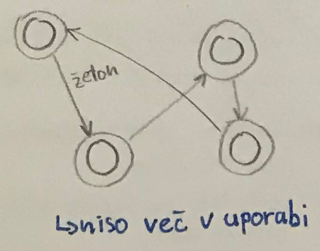

---

## ALOHA

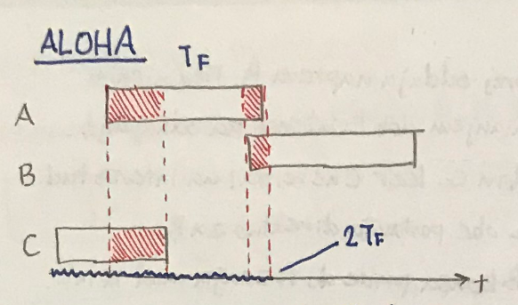

* V tem primeru moramo vse 3 okvirje ponovno poslati, ker bodo podatki zaradi trčenj ne razpoznavni

* $T_F$ je čas okvirja

* $2T_F$ za pošiljanje enega okvirja imamo $2T_F$ časa -  v tem času ne sme pošiljati nobena druga naprava
  
  * <= 50% izkoriščenost

$P_k = \frac {λ^{k}\ *\ e^{-λ}}{k!}$

* $P_1$ - v intervalu začne z oddajo ENA postaja

* $P_1 = \frac {2λ\ *\ e^{-2λ}} {1!} = 2λ\ *\ e^{-2λ}$

* **Izkoriščenost omrežja**: $E = \frac {P_1} {2}$

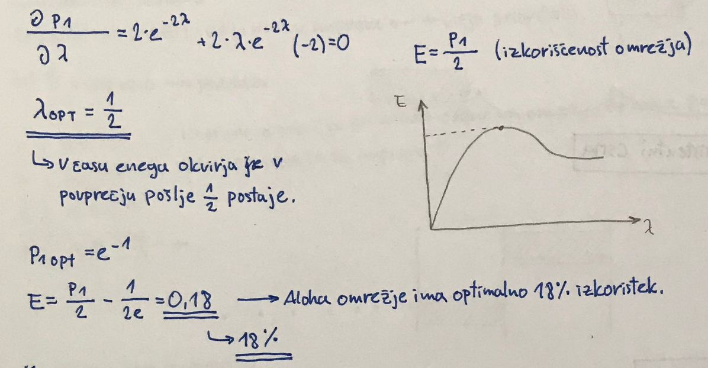

### Čisti ALOHA

### <u>PREDALČNI ALOHA (S-ALOHA)</u>

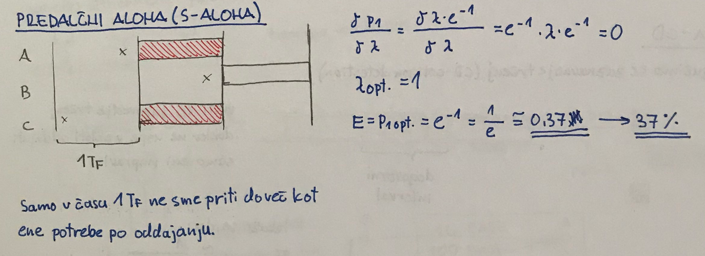

* Samo v času $1T_F$ ne sme priti do več kot ene potrebe po oddajanju

* $λ_{OPT.} = 1$

* $E = P_{1 opt.} = e^{-1} = 0.37 = 37$%

---

## CSMA (Izboljšan čisti ALOHA)

* Najprej oddaja naprava B. Med njenim oddajanjem dobita interes za oddajanje še A in C. Ker C ne ve, da ima interes tudi A, se obe postavita direktno za B. Ko B konča, pride do trčenja med A in C. Sedaj napravi določita vsak svoj naključni čas (naključno dodeljevanje) in poveča se možnost, da ne pride do trka med njima.

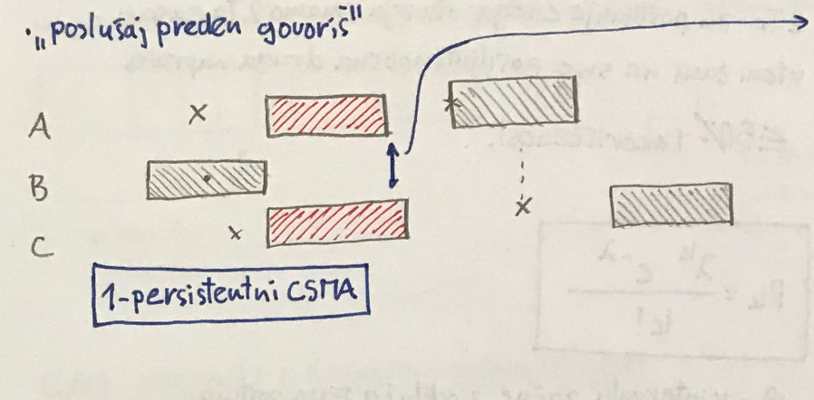

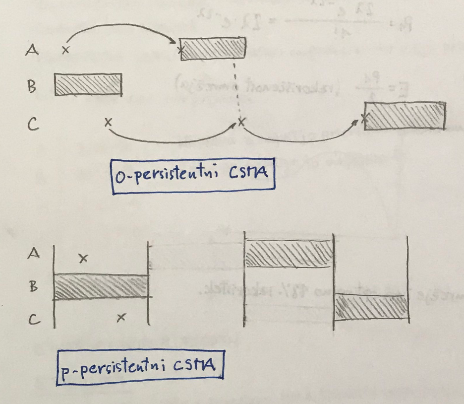

### CSMA - CD

* vkljčimo še zaznavanje trčenj (CD - collision detection)

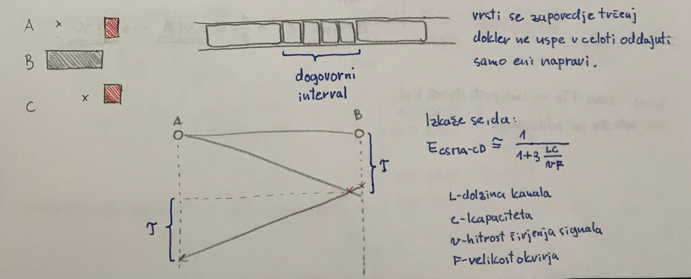

* vrti se zapordenje trčenj dokler ne uspe v celoti oddajati samo eni napravi

* Izkaže se, da:
  
  * $E_{CSMA-CD} = \frac {1} {1\ +\ 3\frac{LC} {vF}}$
  
  * L - dolžina kanala
  
  * C - kapaciteta
  
  * v - hitrost širjenja signala
  
  * F - velikost okvirja

---

# <u>REZERVACIJSKI PROTOKOLI</u>

* **Napovedni interval** - vsaka postaja dobi čas, ko lahko najavi potrebo po oddajanju

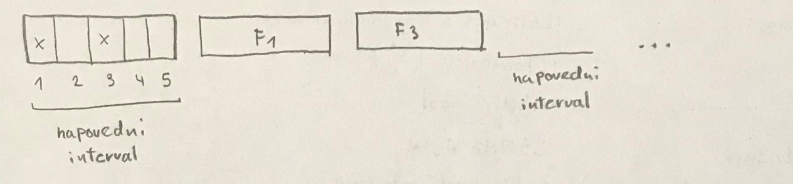

## CAN - Protokoli z binarnim naslavljanjem

* Za industrijska omrežja - uporablja se tudi v avtomobilih

* **Controller Area Network**

* **PRIORITETNI SISTEM** - višji naslov naprave => višja prioriteta

* bit 1 => visok nivo => prevlada

* Naprava z najvišjo prioriteto ostane na omrežju do konca pošiljanja

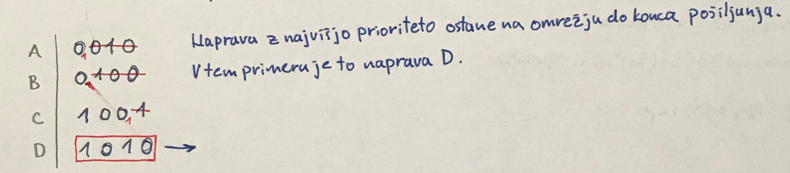

* Ethrenet, WiFi, Bluetooth

### <u>Ethrenet</u>

* začetki Etherneta - povezava prek koaksialnega kabla
  
  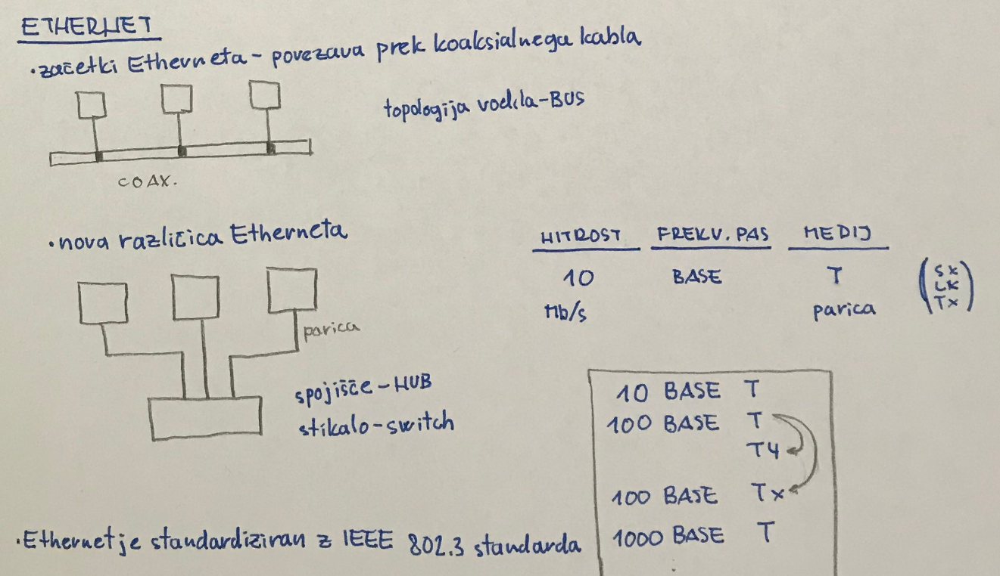

### 10 BASE T

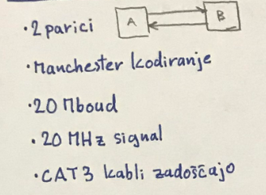

### 100 BASE TX

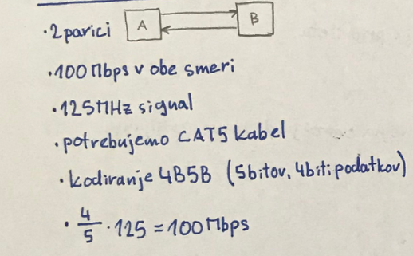

### 100 BASE T4

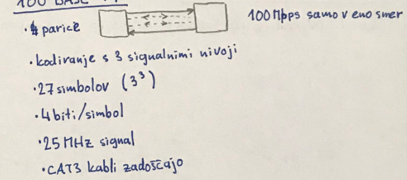

### 1000 BASE T