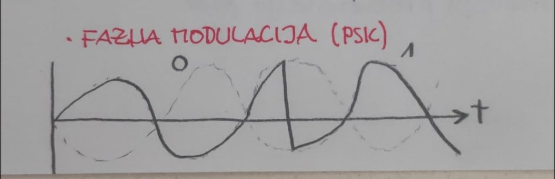

# Omrezja predavanja

## Ponovitev

**Način zapisa signala** določa **fizični sloj**

Za ponovno **pošiljanje podatkov v primeru trčenja podatkov** je odgovoren **linijski sloj** 

Za usmirjanje je odgovoren **mrežni sloj**

---

# Fizični sloj

* kabel
  
  * optični
  
  * električni
    
    * parica: kabel, ki ima dve ali štiri žili, ki sta med seboj prepleteni
    
    * koaksialni kabli

* brezšično
  
  * RF ~ radijski valovi
  
  * IR
  
  * svetloba


Signali so različno dinamični

Hitrost v **baud-ih**:

* **baud** = **število sprememb signala v časovni enoti**

```
imamo 5 bit/s torej:
    NRZ-L: 5 baud
    NRZI-I: 5 baud
    MANCHESTER KODIRANJE: 10 baud
```


**Simbol** predstavlja 2 bita


---

## Fourierov transform

Kako zapistai poljuben signal z **vsoto sinusnih signalov** !!


---

## Nyquistov teorem

$f_{vz}>2*f_{max}$

$C_{max}=2*H*log_{2}V$ [$bit/s$]

* $log_{2}V$     je število $bitov / simbol$

* $V$             je število signalnih nivojev 

Na signal, ki gre po kanalu vplivajo **motnje**

$U_{out} == f_{1}*(U_{in}) + f_{2}*(motnje)$

* $f_{2}*(motnje)$  =~ T

**Rzmerje signal-šum** $S/N$

* obi;ajno ga podajamo v **dB** - decibelih

$S/N$        [dB]

   10             10

  100            20

 1000           30

     .                .

     .                .

----

## Shannonovo pravilo

$C_{max}=H*log_{2}(1 + S/N)$ [bit / s]

* S/N je razmerje => nima enote

---

## Prenos podatkov v višjih frekvenčnih pasovih

###### Aplitudna modulacija (ASK) - AM band

* **nizka amplituda**   = 0

* **visoka amplituda** = 1
  
  

###### Frekvenčna modulacija (FSK) - FM band
  

###### Fazna modulacija (PSK)
  

---

## Konstelacijski diagrami
