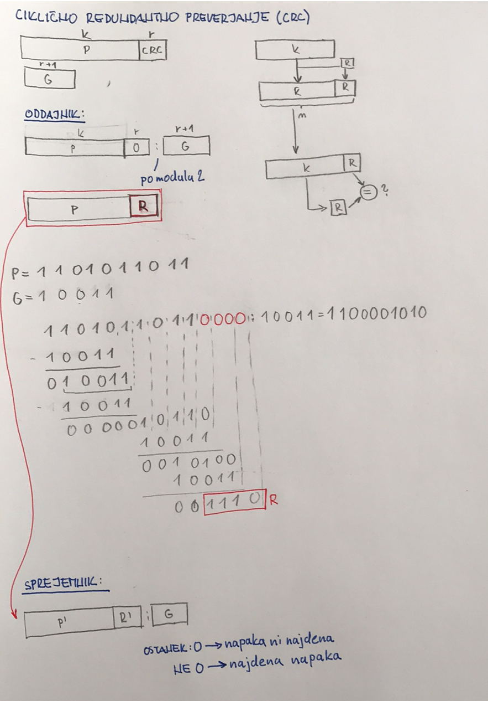

# Linijski sloj:

Nlegov namen je: Zanesljiva komunikacija med dvema vozliscama (napravama):

* Okvirjanje

* Nadzor nad napakami

* Nadzor pretoka

* MAX - Medium Access Control; ni isto kot MAC naslov 

Operacije na linijskem sloju:

# 1. Okvirnaje

* Krmiljenje pretoka
  
  * hitri podatki, naprava ki jih procesira pa je pocasna

* Nadzor dostopa do prenosnega sredstva
  
  * S-ALOHA

* ### Povezavna storitev
  
  * Ce zelis poslati podatke se mores najprej vzkladit z napravo se nato lahko posljes podatke
  
  * **Point to point** protokol

* ### Nepovezavna storitev
  
  * S potrjevanjem
    
    * potrebujemo, ko imamo potrebo po tem
    
    * Primer:  WiFi
  
  * Brez potrjevanja
    
    * Primer: Ethernet 

* MAC

### Asinhrono delovanje omrežij

* Ves cas bo na nizkem nivoju dokler oddajnik začne posiljati podatke

* Naredimo spremembo

* V intervalu enega bita bomo imeli 1 na kanalu to je naš **start bit**

* Nadozor nad napakami: lahko dodamo paritetni bit

### Sinhrono delovanje omrežij

## Načini označevanja okvirejv:

1. Okvirjanje z štetjem znakov
   
   * Prvi bit v okvirju nosi podatek o tem koliko okvirov nosi podatke
   
   * Za vsako sekvenco okvirjev z podatki sledi okvir ki pove koliko okvirjov z podatki mu sledi
   
   * Problem je če pride do napake pri okvirju z iformacijo o tem koliko okvirjev z podatki mu sledi
   
   * Tako okvirjanje samo po sebi v večini primerov ni zadostno

2. Okvirjanje z zastavicami in urivanjem znakov
   
   * Na začetku okvirja pošljemo nek niz znakov, ki označuje začetek, temu pravimo **zastavica** 
   
   * [ |zastavica| [DATA] |zastavica| ]
   
   * problem je v tem ker se niz znakov ~ **zastavica** pojavi med podatki zato urinimo poseben znak **ESC** 
   
   * [ |zastavica| |ESC| [DATA] |zastavica| ]

3. Okvirjanje z zastavicami in urivanjem bitov
   
   * [ |01111110| [DATA] |01111110| ]
   
   * petim 1 vedno sledi 0

4. Okvirjanje s fizičnim kodiranjem signala

# 2. Nadzor napak

## Zaznavanje napak

* napako predstavlja 0 ko bi morala biti 1 oz. 1 ko bi morala biti 0

* $P_{B}$ - verjetnost napake bita

* $P_{1}$ - okvir brez napak           $F$ - dolzina okvirja
  
  * $P_{1}=(1 - P_{B})^F
    $

* $P_{2}$ - okvir z neodkrito napako

## Popravlnaje napak

* **kodirnik (encoder)**, ki vsak simbol S **zakodira** v simbol W

* **dekodirnik (decoder)**, ki vsak simbol dekodira
  
  ```
  s ∈ S => Kodirnik (S -> W) => w ∈ W 
  => Komunikacijski kanal 
  => v ∈ V => Dekodirnik (V -> Z) => z ∈ Z
  ```

* Odkrivanje št. napak:            $d >= e+1$

* Popravlanje napak:               $d >= 2e + 1$

## Ciklično redundantno preverjanje (CRC)

[       P     |CRC|]

* Delovanje na strani oddajnika:
  
  * [        P      | 0 |  :  | G  ]
  
  * na konec P dodamo r 0
  
  * deleneje po $mod_2$
  
  * Primer:
    
    * 
