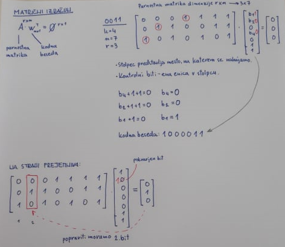
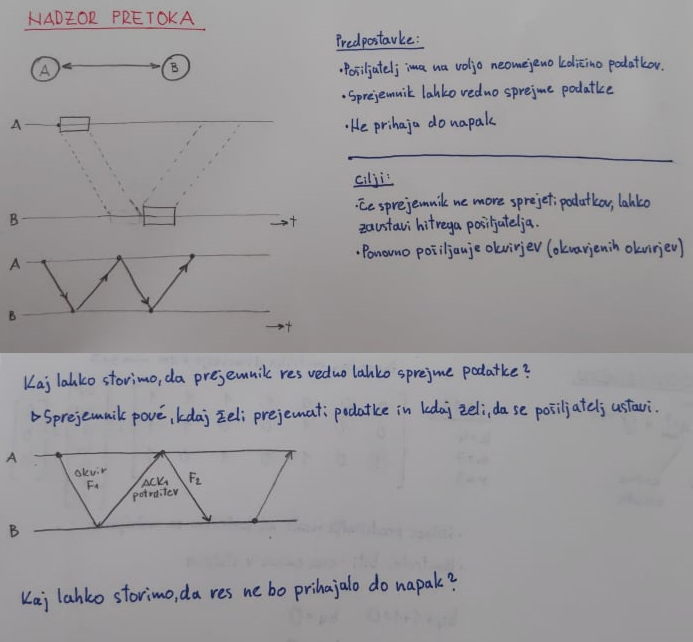
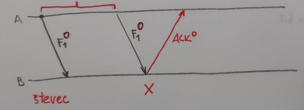
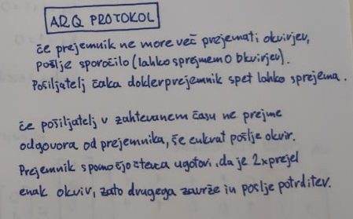

Primer:

```
 Soda pariteta & dodamo se en bit
 0 0 0
 1 1 1
---------------------
 Pb = 0.1
         [ 0.9 * 0.1 = 0.09 ]
 01 ____ 00
    \___ 11
         [ 0.1 * 0.9 = 0.09 ]
 Verjetnost je enaka ne moramo sklepat napake
         [ 0.9 * 0.9 * 0.1 = 0.081]
 001 ___ 000
     \__ 111 
         [ 0.1 * 0.1 * 0.9 = 0.009]
 Lahko zakljucimo, da je pravilno poslano 000
 Poslali smo tri bite ~ KODE Z PONAVLANJEM (ni ucinkovito)
```

**Kodirnik** nam vhodne **podatke** spremeni v **vhodne besede**

**Dekodirnik** nam **vhodne besede** spremni v **podatke** 

$(n+1) * 2^k$ <= $2^n$

* k je **št. vhodnih bitov**

* r je **redundanca**

$n=k+r$

$r=n-k$

$k+r+1 <= 2^{r}$  = 

```
k = 4 ... št vhodnih bitov


r = 1 n = 5

6 <= 2 //

r=2 n=6
7 <= 4 //

r=3 n=7
8 <= 8 O.K.


E = (k / n) - 
```

## Hammingov kod

* Biti na pozicijah (indexih)  $2^n$ postane **kontrolni bit**

* Ostale bite kontrolirajo tisti biti katerih sestevek njihovih indexov je index tega bita
  
  * 3 = 2 + 1 
  
  * 5 = 4 + 1
  
  * 6 = 4 + 2
  
  * 7 = 4 + 2 + 1

## Matrični izračun

$A*w^r = 0$

* **A** je **parnostna matrika**, vedno bo imela dimenzije **r x n**

* **w** je vhodna beseda, dimenzija **n x 1**



```
A------------> B

A --[-----]---------|---|----->
     \     \       /   /
      \     \    /   /
       \     \ /   /
B ------|-----|---]----------->
```

Predpostavke:

1. Pošiljatelj razpolaga z veliko podatki

2. Sprejemnik lahko vedno sprejme podatke

3. Ne prihaja do napak

Cilji:

1. Če sprejemnik ne prejme podatkov lahko zaustavi hitrega pošiljatelja

2. Ponovno pošiljanje okvarjenih okvirjev

---

# ARQ protokol



Uvedemo **časovnik**:


Uvedemo **števec**:



* $T_z$ ..... čas zakasnitve

* $T_f$ ..... čas okvirja

* $T_d$ ..... čas podatkov

* Časovnik začenmo, ko moramo poslat nov okvir



### Izračun izkoristka

$E = \frac {T_D} { T_S} = \frac {T_D} { T_{F} + T_{A} + 2 * T_{Z}}$

Pošiljanje enega in istega okvirja izračunamo:

* $k-1 = \frac {p} {1-p}$


$E_p = \frac {T_P} {T_F + T_A + 2 * T_Z + \frac {p} {1-p} * (T_0 + T_F)}$

Primer:

**verjetnost napake**: P=0.01

C = 10 Gb/s

F =  1542 B = 12336 bit

D = 1500 B = 12000 bit

A = 84 B = 672 bit

L = 128 km

v = 200000 km / s

$T_0$ = 2 $T_z$ + $T_A$


$T_D = D / C$

$T_Z = L / v$

$E_{ARQ} = 0.08$

**Protokoli brez čakanja** namesto **ARQ**:

* Na koncu pošiljanja vsekega okvirja pošljemo naslednji okvir, brez čakanja na potrditev prejšnjega okvirja

* Potrebujemo **full duplex način prenosa** v obe smeri, ker okvirji potujejo istočasno v obe smeri

## Protokoli z drsečim oknom

* **velikost okna** je **število okvirjev**, ki so **poslani** in so **nepotrjeni**

* Optimalna velikost okna:
  
  * w = 8
  
  * $w_{optimalna}=\frac {T_S} {T_F}$
  
  * $w_optimalna$ je tudi **velikost  začasnega pomnilnika POŠILJATELJA**

* Večje drseče okno nam ne pomaga

* Če pride do **napake**:
  
  1. Počakamo na **pravilno prejet** naslednji okvir => imenovan **GBN**
  
  2. **Sprejmemo predčasno vse okvirje**, če-tudi ne v pravem vrstnem redu => imenovan **SRP** - selective repeat 

* Učinkovitost GBN:
  
  * $E_{GBN} = min(1, \frac {w * T_F} {T_S})$ to velja samo za primer, ko je **P = 0** (ko je 0 napak)
  
  * $E_{GBN} = 1 - p * \frac {T_S} {T_F}$ 

* Učinkovitost SRP:
  
  * $E_{SRP} = min(1, \frac {w * T_F} {T_S})$ to velja samo za primer, ko je **P = 0** (ko je 0 napak)
  
  * $E_{SRP} = 1-p$